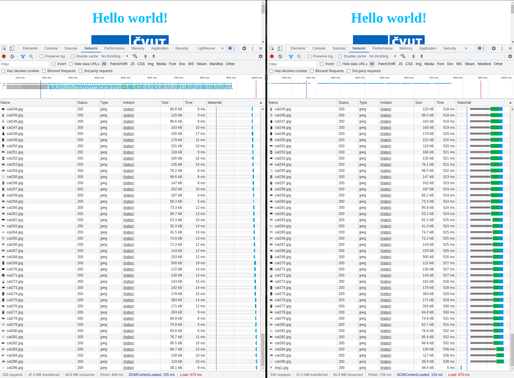

# HW6 - HTTP/2 multiplexing

https://courses.fit.cvut.cz/NI-AM2/hw/06/index.html
___
* Vytvořil jsem dvě implementace serverů.
  * `src/http-server.js`
  * `src/http2-server.js`
* Obě implementace posílají soubor `src/index.html` který obsahuje odkazy na CSS a obrázky, které se nachází ve složce `static`.

* Na levé straně je vidět waterfall komunikace s **http** serverem, kde se většinu času čeká na posílání requestů.
* Na pravé straně je vidět waterfall komunikace s **http2** serverem, kde naopak čeká na response.

