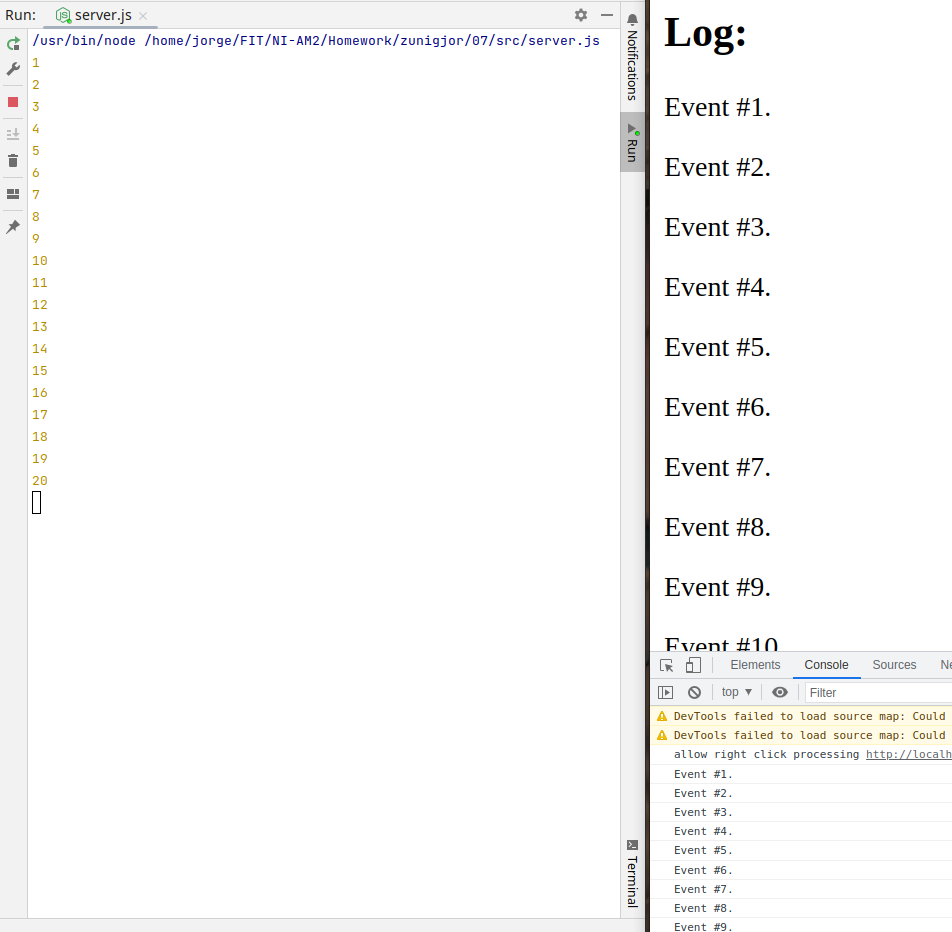

# HW7 - Server-Sent Events

https://courses.fit.cvut.cz/NI-AM2/hw/07/index.html
___

* Vytvořil jsem jednoduchou implementaci serveru, který každé dvě sekundy streamuje event se zvyšujícím se id.
* A vytvořil jsem jedoduchou HTML stránku, která eventy příjmá a zobrazuje s pomocí `EventSource`.

