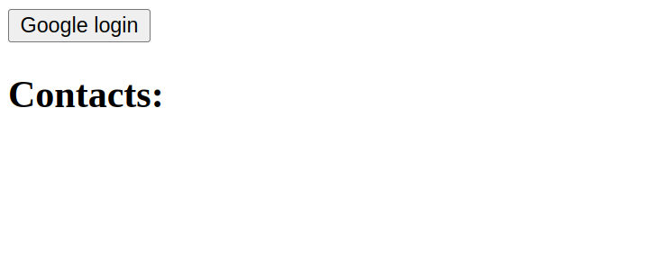
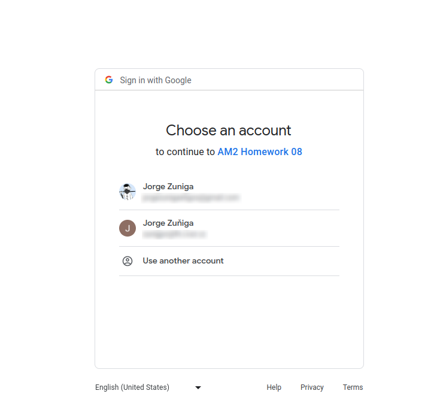
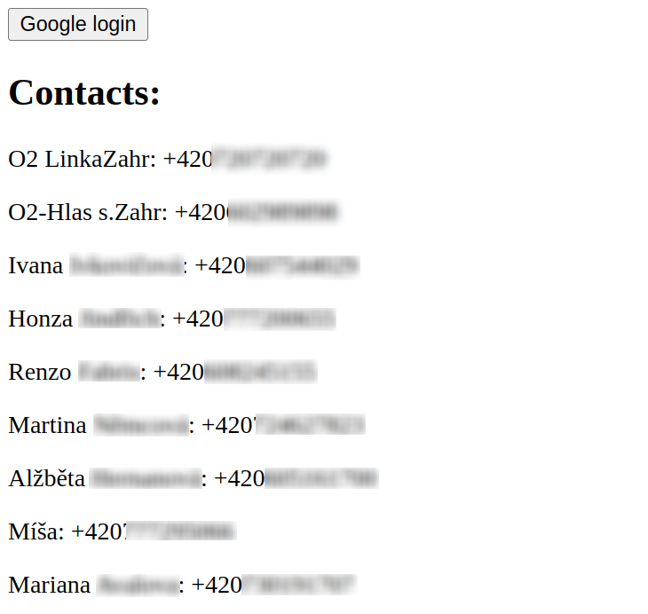

# HW8 - OAuth - Browser-Based App

https://courses.fit.cvut.cz/NI-AM2/hw/08/index.html
___
Naimplementoval jsem jednoduchý `https` server poskytující `index.html`.

Strákna `index.html` obsahuje veškerou logiku pro přihlášení skrze Google OAuth 
a následné zobrazení kontaktů skrze People API.

Čerpal jsem z:
* https://developers.google.com/identity/protocols/oauth2/javascript-implicit-flow
* https://console.cloud.google.com/apis/credentials
* https://developers.google.com/people

### /

### Login

### /callback
